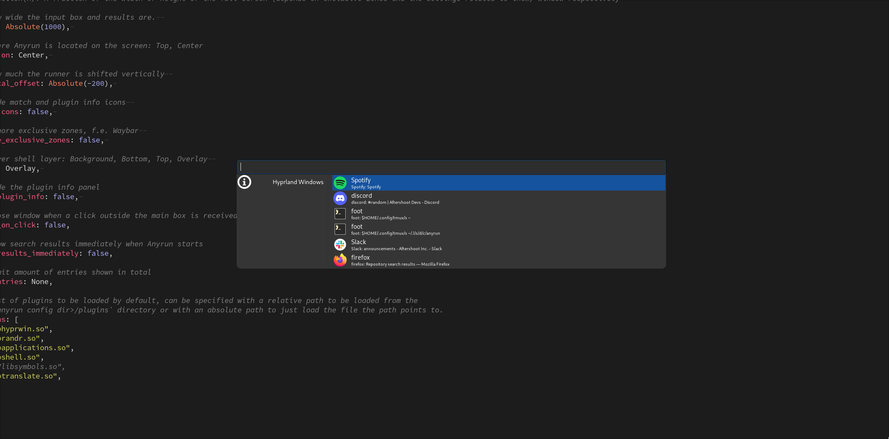

# anyrun-hyprwin

An [anyrun](https://github.com/Kirottu/anyrun) plugin to show active [hyprland](https://hyprland.org/) windows and focus them on selection




How to install:
```sh
just install
```
How to build:
```sh
cargo build --release # or `just build`
```

And add `libhyprwin.so` to `plugins` array in your  `~/.config/anyrun/config.ron`

```diff
diff --git a/config/anyrun/config.ron b/config/anyrun/config.ron
index 80f32cc..d043da0 100644
--- a/config/anyrun/config.ron
+++ b/config/anyrun/config.ron
@@ -36,6 +36,7 @@ Config(
   // List of plugins to be loaded by default, can be specified with a relative path to be loaded from the
   // `<anyrun config dir>/plugins` directory or with an absolute path to just load the file the path points to.
   plugins: [
+    "libhyprwin.so",
     "librandr.so",
     "libapplications.so",
     "libshell.so",
```
